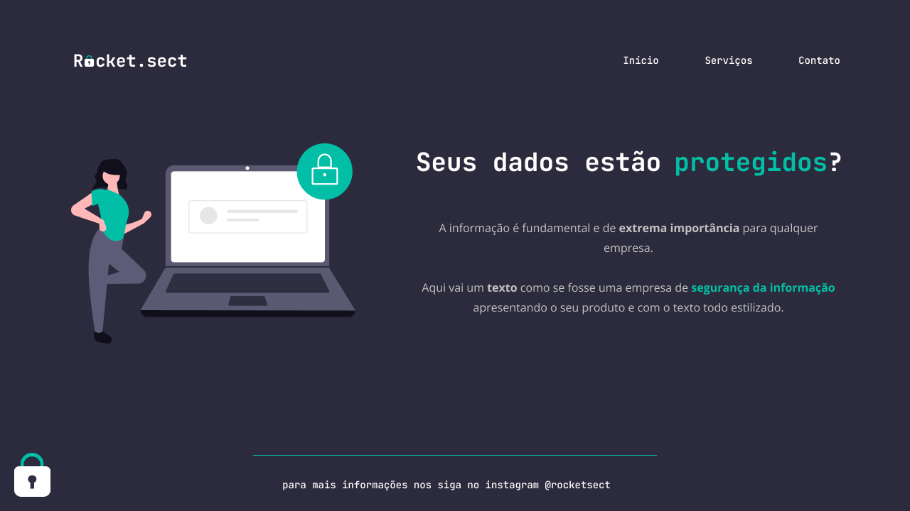

<h1 align="center"> Desafio avançado - Recriando layout</h1>

  <a href="#-tecnologias">Tecnologias</a>&nbsp;&nbsp;&nbsp;|&nbsp;&nbsp;&nbsp;
  <a href="#-projeto">Projeto</a>&nbsp;&nbsp;&nbsp;|&nbsp;&nbsp;&nbsp;
  <a href="#-layout">Layout</a>

 

  

## 🚀 Tecnologias

Esse projeto foi desenvolvido com as seguintes tecnologias:

- HTML e CSS
- Figma

## 💻 Projeto

O "Desafio avançado - Recriando layout" é um desafio da trilha Explorer da Rocketseat, o desafio é desenvolvido no "Stage 02 - Introdução ao HTML e CSS".

- [Link do desafio](https://efficient-sloth-d85.notion.site/Desafio-avan-ado-Recriando-layout-17338681d78c439aa64ac9474d7c6d92)

- [Acesse o desafio finalizado, online](https://lybiomoraesjr.github.io/RocketseatExplorer_HTML_CSS_Challenge_Recreating_Layout02/)

## 🔖 Layout

Você pode visualizar o layout do projeto através [DESSE LINK](https://www.figma.com/file/EdKjPWjC8ZlbnH4XzTObv2/Explorer/duplicate). É necessário ter conta no [Figma](https://figma.com) para acessá-lo.

---

Feito com ♥ by Lybio Moraes Junior

